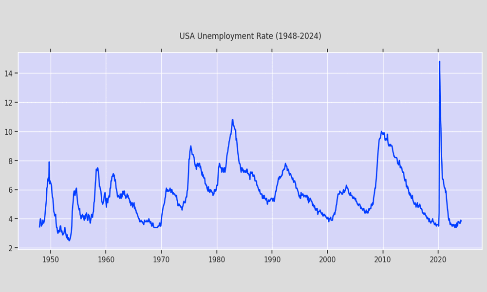

# USA Unemployment

A small project for data exploration and visualization using the Federal Reserve Economic Data (FRED) API, focusing on the COVID-19 pandemic's impact on unemployment and participation rates in the USA.



## Concepts and technologies employed

- Python:

  - Pandas
  - Matplotlib
  - Seaborn
  - Plotly
- OOP
- FRED API


## Installation

1. Clone the repository:

  ```bash
  git clone https://github.com/your-username/project-name.git
  ```

2. Install the required Python libraries:

  ```bash
  pip install -r requirements.txt
  ```

## Usage

1. Update the API key in the `config.py` file with your FRED API key.

2. Run the Python script:

  ```bash
  exploratory-analysis.py
  ```

3. Follow the prompts to explore and visualize the data.

## Contributing

Contributions are welcome! If you find any issues or have suggestions for improvements, please open an issue or submit a pull request.

## Disclaimer

This project follows and builds upon [this tutorial](https://www.youtube.com/watch?v=R67XuYc9NQ4&ab_channel=RobMulla) by Rob Mulla.

### About the FRED API

_Short for Federal Reserve Economic Data, FRED is an online database consisting of hundreds of thousands of economic data time series from scores of national, international, public, and private sources. FRED, created and maintained by the Research Department at the Federal Reserve Bank of St. Louis, goes far beyond simply providing data: It combines data with a powerful mix of tools that help the user understand, interact with, display, and disseminate the data. In essence, FRED helps users tell their data stories. The purpose of this article is to guide the potential (or current) FRED user through the various aspects and tools of the database._


## Contact

For any questions or inquiries, please contact [julianr.data@gmail.com](mailto:julianr.data@gmail.com).
